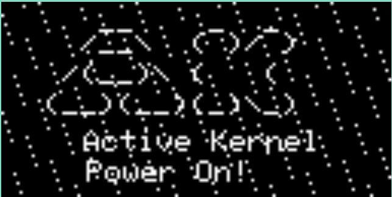
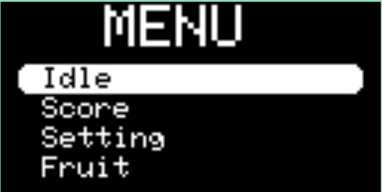
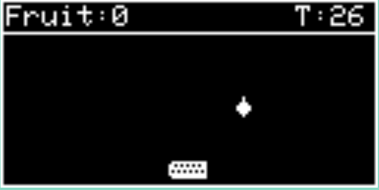
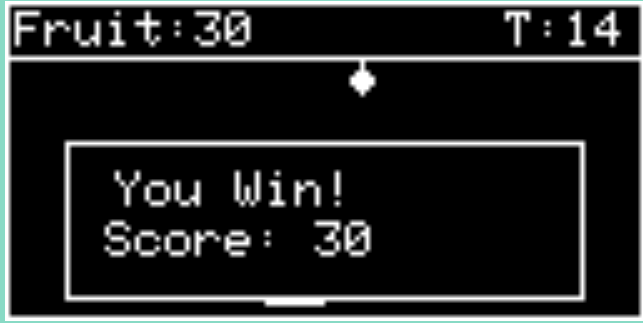
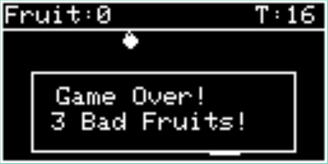
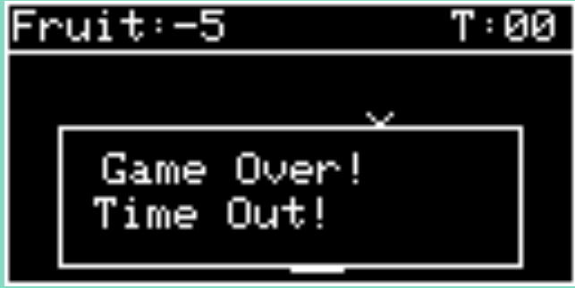

# AKKit Fruit Game - STM32L Embedded Game System

A sophisticated embedded game system running on the STM32L151CBT6 microcontroller, featuring an interactive fruit catching game and chart-based games with a custom LCD display driver and wireless networking capabilities.

---

## 📋 Table of Contents

- [Overview](#overview)
- [Features](#features)
- [Hardware Specifications](#hardware-specifications)
- [Project Architecture](#project-architecture)
- [Getting Started](#getting-started)
- [Build Instructions](#build-instructions)
- [Programming & Flashing](#programming--flashing)
- [Project Structure](#project-structure)
- [Game Modules](#game-modules)
- [Development](#development)
- [Troubleshooting](#troubleshooting)
- [License](#license)
- [Game Sample](#game-sampling)
- [Additional Resources](#additional-resources)
- [License](#license)

---

## 🎮 Overview

The AKKit Fruit Game is a cutting-edge embedded systems project that combines game development with real-time embedded programming on the ARM Cortex-M3 architecture. The system provides an interactive gaming experience with LCD graphics rendering, button input handling, buzzer audio feedback, and wireless networking capabilities.

**Key Highlights:**
- Real-time operating system architecture with multiple concurrent tasks
- Sophisticated display management with SSD1306 OLED support via Adafruit GFX library
- Interactive game mechanics with physics simulation
- Persistent storage via EEPROM and Flash memory
- Wireless networking stack for potential multiplayer capabilities
- Modular screen/UI framework with multiple game screens

---

## ✨ Features

### Core Gaming Features
- **Multiple Game Modes**: Fruit catching game, chart-based games, and extensible framework for additional games
- **Interactive UI**: Menu system, game settings, game-over screen with restart capability
- **Real-time Physics**: Fruit collision detection with basket, dynamic fruit spawning
- **Game Persistence**: Save/load game state using EEPROM and Flash storage
- **Audio Feedback**: Buzzer integration for game events and UI interactions

### Hardware Integration
- **Display**: SSD1306 OLED display with 128x64 resolution via SPI interface
- **Input**: Multiple button inputs for game controls and menu navigation
- **Storage**: EEPROM for configuration, Flash for firmware updates
- **Communication**: UART serial interface for debugging and serial commands
- **Power Management**: Optimized for battery-operated deployment

### System Architecture
- **Real-Time Task Management**: Multi-threaded architecture with task schedulers
- **Display Buffer Management**: Efficient graphics rendering with bitmap support
- **State Machine Framework**: Screen manager implementing screen lifecycle
- **Command Line Interface**: Serial shell for system configuration and debugging
- **Error Logging**: Queue-based logging system for system diagnostics

---

## 🔧 Hardware Specifications

### Microcontroller
| Specification | Value |
|---|---|
| **MCU** | STM32L151CBT6 (ARM Cortex-M3) |
| **Flash Memory** | 128 KB (0x08000000 - 0x0801FFFF) |
| **SRAM** | 16 KB |
| **Package** | LQFP100 |
| **Operating Voltage** | 1.65 - 3.6 V |
| **Max Frequency** | 32 MHz |

### Memory Layout
| Region | Address | Size | Purpose |
|---|---|---|---|
| Boot Loader | 0x08000000 - 0x08002FFF | 12 KB | Device firmware |
| Application | 0x08003000 - 0x0801FFFF | 116 KB | Game firmware |
| Flash Base | 0x08000000 | - | Flash memory base address |

### Peripheral Interfaces
- **SPI**: Display (SSD1306 OLED)
- **UART**: Serial communication (115200 baud)
- **GPIO**: Button inputs, LED outputs, buzzer control
- **ADC**: Analog sensor inputs
- **Flash/EEPROM**: Non-volatile storage

---

## 🏗️ Project Architecture

### System Overview
```
┌─────────────────────────────────────────────────────────┐
│                  AKKit Game System                      │
├─────────────────────────────────────────────────────────┤
│                   Application Layer                     │
│  ┌──────────────┬──────────────┬──────────────────────┐ │
│  │ Game Engine  │ Screen Mgr   │ Task Manager         │ │
│  │ - Fruit      │ - Idle       │ - Display Task       │ │
│  │ - Charts     │ - Menu       │ - Firmware Task      │ │
│  │ - Game Over  │ - Settings   │ - Life Task          │ │
│  │              │ - Startup    │ - UART Interface     │ │
│  └──────────────┴──────────────┴──────────────────────┘ │
├─────────────────────────────────────────────────────────┤
│                    Driver Layer                         │
│  ┌──────────────┬──────────────┬──────────────────────┐ │
│  │ Display (GFX)│ Input (GPIO) │ Audio (Buzzer)       │ │
│  │ - SSD1306    │ - Button     │ - Beep/Tone          │ │
│  │ - Bitmap     │ - Interrupt  │ - Volume Control     │ │
│  │ - Adafruit   │ - Debounce   │                      │ │
│  └──────────────┴──────────────┴──────────────────────┘ │
├─────────────────────────────────────────────────────────┤
│                Platform & HAL Layer                     │
│  ┌──────────────┬──────────────┬──────────────────────┐ │
│  │ GPIO Control │ SPI Interface│ UART/Serial          │ │
│  │ Flash/EEPROM │ Networking   │ Timer/Clock          │ │
│  └──────────────┴──────────────┴──────────────────────┘ │
├─────────────────────────────────────────────────────────┤
│              STM32L151CBT6 Hardware                     │
└─────────────────────────────────────────────────────────┘
```

### Task Architecture
The system implements multiple concurrent tasks:
- **Display Task**: Handles rendering and screen updates
- **Firmware Task**: Manages system firmware updates
- **Life Task**: Monitors system health and timeout handling
- **UART Interface Task**: Handles serial communication and command processing
- **Game Logic Task**: Executes game physics and state updates

---

## 🚀 Getting Started

### Prerequisites
- **ARM GCC Toolchain**: gcc-arm-none-eabi (tested with 10.3-2021.10)
  ```bash
  # Ubuntu/Debian
  sudo apt-get install arm-none-eabi-gcc arm-none-eabi-binutils
  
  # Or download from ARM website
  ```

- **STM32 Programmer**: STM32CubeProgrammer or OpenOCD
  ```bash
  # Via apt
  sudo apt-get install openocd
  ```

- **Build Tools**:
  ```bash
  sudo apt-get install make git
  ```

### Cloning the Repository
```bash
git clone https://github.com/yourusername/akkit-fruit-game.git
cd akkit-fruit-game
```

### Initial Configuration
Edit the Makefile in the `application/` and `boot/` directory to set your environment paths:

```makefile
# Set your GCC toolchain path
GCC_PATH = /path/to/gcc-arm-none-eabi-10.3-2021.10-x86_64-linux

# Set your STM32 programmer path (if using STM32CubeProgrammer)
PROGRAMER_PATH = /path/to/STM32CubeProgrammer/bin

# Set OpenOCD configuration path
OPENOCD_CFG_PATH = /usr/local/share/openocd/scripts/board/stm32ldiscovery.cfg

# Console UART baudrate
SYS_CONSOLE_BAUDRATE = 115200
```

---

## 🔨 Build Instructions

### Building the Application

Navigate to the application directory and build:

```bash
cd application/
make clean          # Clean previous builds
make -j2            # Compile with parallel jobs (uses 2 cores)
```

**Build Targets:**
| Target | Description |
|---|---|
| `make` | Compiles the application (default target) |
| `make -j2` | Parallel compilation with 2 jobs |
| `make clean` | Removes all build artifacts |
| `make rebuild` | Clean followed by full build |

### Build Artifacts

After successful compilation, you'll find:
- **Executable**: `build_ak-base-kit-stm32l151-application/ak-base-kit-stm32l151-application.axf`
- **Binary**: `build_ak-base-kit-stm32l151-application/ak-base-kit-stm32l151-application.bin`
- **Symbol Map**: `build_ak-base-kit-stm32l151-application/ak-base-kit-stm32l151-application.map`
- **Dependencies**: `.d` files for dependency tracking
- **Stack Usage**: `.su` files for stack analysis

### Build Configuration

**Optimization Levels** (defined in Makefile):
- `-Os`: Default - optimizes for code size with reasonable speed

**Available Options**:
- `-g`: Debug symbols included
- `-O0`: No optimization (slow but debugging-friendly)
- `-O2`: Balanced optimization
- `-O3`: Aggressive optimization (largest binary)

---

## 📝 Programming & Flashing

### Method 1: OpenOCD + GDB (Recommended for Development - Windows)

Start the OpenOCD server:
```bash
openocd -f /usr/local/share/openocd/scripts/board/stm32ldiscovery.cfg
```

In another terminal, launch GDB and flash:
```bash
cd application/
arm-none-eabi-gdb build_ak-base-kit-stm32l151-application/ak-base-kit-stm32l151-application.axf

# Inside GDB:
(gdb) target remote localhost:3333
(gdb) source stm32l_init.gdb
(gdb) load
(gdb) continue
```

Or use the Make target:
```bash
make flash      # Automatically flashes using OpenOCD
```

### Method 2: STM32CubeProgrammer

```bash
STM32_Programmer_CLI -c port=SWD -e all              # Erase flash
STM32_Programmer_CLI -c port=SWD -d build_ak-base-kit-stm32l151-application/ak-base-kit-stm32l151-application.bin 0x08003000
STM32_Programmer_CLI -c port=SWD -rst               # Reset device
```

### Flashing the Bootloader
```bash
cd boot/
make -j2
make flash      # Flashes boot sector (requires different load address)
```

### Verifying Flash
After programming, check if the device is responsive:
```bash
# Connect via serial terminal (115200 baud)
screen /dev/ttyUSB0 115200
# or
picocom -b 115200 /dev/ttyUSB0
```


## 🎯 Game Modules

### Fruit Catching Game
**An interactive fruit catching game featuring:**
- **Falling Fruits**: 6 different fruits (3 good, 3 bad) that spawn and fall every 110ms
- **Basket Control**: Player moves the basket left/right using button controls
- **Scoring System**: +10 point for catching good fruits, -5 point for bad fruits
- **Countdown Timer**: 30-second gameplay timer with real-time display
- **Collision Detection**: Accurate detection of fruit-basket collisions
- **Game State**: Score tracking, caught fruit tracking, and game-over detection

**Game Mechanics**:
- Fruits fall continuously from the top of the screen
- Player controls a basket at the bottom using left/right buttons
- Good fruits (3 types) increase score when caught
- Bad fruits (3 types) decrease score when caught
- Game ends when the 30-second countdown reaches zero

**Key Files**:
- [app/screens/scr_fruit_game.cpp](application/sources/app/screens/scr_fruit_game.cpp) - Main fruit game logic
- [app/screens/scr_fruit_game.h](application/sources/app/screens/scr_fruit_game.h) - Game definitions and structures

### Chart Game
Analytics-based games with visual data representation:
- **Dynamic Data Display**: Real-time chart rendering
- **User Interaction**: Button-based input handling
- **Scoring System**: Points based on game mechanics

**Key Files**:
- [app/screens/scr_charts_game.cpp](application/sources/app/screens/scr_charts_game.cpp)


#### GDB Debugging
```bash
cd application/
arm-none-eabi-gdb build_ak-base-kit-stm32l151-application/ak-base-kit-stm32l151-application.axf
(gdb) target remote localhost:3333
(gdb) break app.cpp:main
(gdb) continue
(gdb) step
(gdb) print variable_name
```

#### Stack Usage Analysis
Check `.su` files in build directory:
```bash
cat build_ak-base-kit-stm32l151-application/app.su | sort -k2 -rn | head -20
```

### Memory Analysis

**Check Binary Size**:
```bash
arm-none-eabi-size build_ak-base-kit-stm32l151-application/ak-base-kit-stm32l151-application.axf
```

**Memory Constraints**:
- Flash: 128 KB (Boot: 12KB, App: 116KB)
- SRAM: 16 KB

**Optimization Tips**:
- Use `-Os` flag for code size reduction
- Avoid large stack allocations
- Use const for read-only data

---

## 🐛 Troubleshooting

### Build Issues

**Problem**: "arm-none-eabi-gcc not found"
```bash
# Solution: Verify toolchain path in Makefile
which arm-none-eabi-gcc
# If not found, install or update GCC_PATH in Makefile
```

**Problem**: Build fails with "permission denied"
```bash
# Solution: Check file permissions
chmod +x application/Makefile
cd application && make clean && make
```

**Problem**: Linker error - "undefined reference to ..."
```bash
# Solution: Ensure all source files are in Makefile.mk
# Edit: application/sources/app/Makefile.mk
# Add missing .cpp files to SOURCES list
```

### Flashing Issues

**Problem**: Device not detected by OpenOCD
```bash
# Solution: Check JTAG/SWD connection
openocd -f /usr/local/share/openocd/scripts/board/stm32ldiscovery.cfg -d
# Should show successful connection
```

**Problem**: Flash operation timeout
```bash
# Solution: Increase timeout or check power supply
# Verify device is powered and debugger is connected properly
# Try erasing flash first: make flash
```

**Problem**: Code doesn't execute after flashing
```bash
# Solution: Verify app start address
# Check: APP_START_ADDR_VAL = 0x08003000 in Makefile
# Ensure bootloader is at 0x08000000
```

### Runtime Issues

**Problem**: Game doesn't display on OLED
```bash
# Debug steps:
# 1. Check SPI connections
# 2. Verify display initialization in app_bsp.cpp
# 3. Test with simple pattern in task_display.cpp
# 4. Check I2C/SPI conflicts
```

**Problem**: Button inputs not responding
```bash
# Debug steps:
# 1. Verify GPIO configuration in io_cfg.cpp
# 2. Check button debouncing in button.cpp
# 3. Test with LED feedback first
# 4. Verify button interrupt handlers
```

**Problem**: System crashes or resets
```bash
# Debug steps:
# 1. Check stack usage (.su files)
# 2. Verify SRAM allocation in linker script
# 3. Monitor task_life.cpp watchdog timer
# 4. Check for buffer overflows in data structures
```
## Game Sampling
---
**Start screen**
<table>
    <tr>
        <p>
            This is the starting screen when the user first flash the codes into the STM32L151
        </p>
        <div style="text-align: center;">
            
        </div>
    </tr>
    <tr>
        <p>
           Please press any button on the starting screen to proceed. The screen will then switch to the MENU screen, where you can navigate through the options by toggling up and down using the MODE button. Select your desired option by pressing MODE
        </p>
        <div style="text-align: center;">
            
        </div>
    </tr>
    <tr>
        <p>
           On the MENU screen, when you select the Fruit option, the screen will transition to the Fruit Collecting Game. You have 30 seconds (timer displayed at the top right) to collect as many fruits as possible. Use the UP and DOWN buttons to move the basket. Collect only the good fruits, and avoid the bad ones. The points are on the Top Left.
        </p>
        <div style="text-align: center;">
            
        </div>
    </tr>
    <tr>
        <p>
           If you collect 3 good fruits, the game will automatically transition you to this screen.
        </p>
        <div style="text-align: center;">
            
        </div>
    </tr>
    <tr>
        <p>
           If you collect 3 bad fruits, the game will automatically transition you to this screen.
        </p>
        <div style="text-align: center;">
            
        </div>
    </tr>
    <tr>
        <p>
           If your timer runs out, the game will automatically transition you to this screen.
        </p>
        <div style="text-align: center;">
            
        </div>
    </tr>
</table>


## 📚 Additional Resources

### Documentation
- **STM32L151 Reference**: [STMicroelectronics Datasheet](https://www.st.com/resource/en/datasheet/stm32l151cb.pdf)
- **ARM Cortex-M3**: [ARM Developer Guide](https://developer.arm.com/documentation/ddi0438/latest/)
- **Adafruit GFX**: [Arduino GFX Library Documentation](https://github.com/adafruit/Adafruit-GFX-Library)

### External Links
- **OpenOCD**: http://openocd.org/
- **GNU ARM Toolchain**: https://developer.arm.com/tools-and-software/open-source-software/developer-tools/gnu-toolchain/gnu-rm
- **STM32CubeProgrammer**: https://www.st.com/en/development-tools/stm32cubeprog.html
- **Image to Bitmap**: https://javl.github.io/image2cpp/
- **GIF maker**: https://gifmake.com/
- **Editing Image to Bitmap**: https://www.photopea.com/

### Community & Support
- **STM32 Community**: https://community.st.com/
- **ARM Community**: https://community.arm.com/

---

## 📄 License

This project is licensed under the **MIT License** - see the [LICENSE](LICENSE) file for details.

```
Copyright (c) 2023 EPCB - IoT Services

Permission is hereby granted, free of charge, to any person obtaining a copy
of this software and associated documentation files (the "Software"), to deal
in the Software without restriction, including without limitation the rights
to use, copy, modify, merge, publish, distribute, sublicense, and/or sell
copies of the Software, and to permit persons to whom the Software is
furnished to do so, subject to the following conditions:

The above copyright notice and this permission notice shall be included in all
copies or substantial portions of the Software.
```

---

## 🤝 Contributing

Contributions are welcome! Please:
1. Fork the repository
2. Create a feature branch (`git checkout -b feature/amazing-feature`)
3. Commit changes (`git commit -m 'Add amazing feature'`)
4. Push to branch (`git push origin feature/amazing-feature`)
5. Open a Pull Request

### Areas for Contribution
- Additional game modules
- Graphics optimization
- Networking improvements
- Documentation enhancements
- Bug fixes and stability improvements

---

## ✉️ Contact & Support

For issues, questions, or suggestions:
- Open an Issue on GitHub
- Submit a Pull Request with improvements
- Contact the development team

---

**Last Updated**: May 18, 2026  
**Maintainer**: Josef\
**Original Author**: Josef

---

<!-- Badge Reference Definitions -->
[contributors-shield]: https://img.shields.io/github/contributors/yourusername/akkit-fruit-game.svg?style=for-the-badge
[contributors-url]: https://github.com/yourusername/akkit-fruit-game/graphs/contributors
[forks-shield]: https://img.shields.io/github/forks/yourusername/akkit-fruit-game.svg?style=for-the-badge
[forks-url]: https://github.com/yourusername/akkit-fruit-game/network/members
[stars-shield]: https://img.shields.io/github/stars/yourusername/akkit-fruit-game.svg?style=for-the-badge
[stars-url]: https://github.com/yourusername/akkit-fruit-game/stargazers
[issues-shield]: https://img.shields.io/github/issues/yourusername/akkit-fruit-game.svg?style=for-the-badge
[issues-url]: https://github.com/joseftanlang/akkit-fruit-game/issues
[license-shield]: https://img.shields.io/github/license/yourusername/akkit-fruit-game.svg?style=for-the-badge
[license-url]: https://github.com/yourusername/akkit-fruit-game/blob/main/LICENSE
[linkedin-shield]: https://img.shields.io/badge/-LinkedIn-black.svg?style=for-the-badge&logo=linkedin&colorB=555
[linkedin-url]: https://linkedin.com/in/yourprofile
